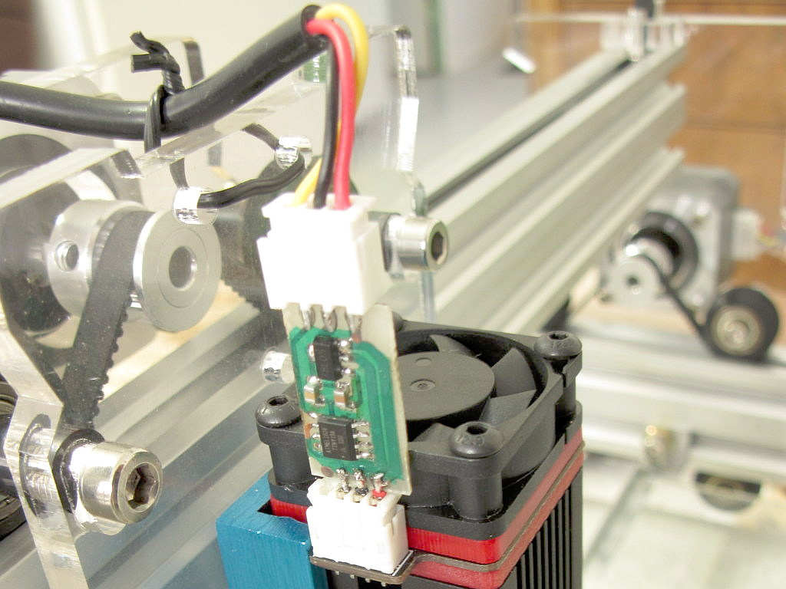

laserdot
========

A small program running in a microcontroller to place between a laser engraver
controller and the laser module to always turn the laser on at a very low duty
cycle, permitting to see the dot to adjust the focus, position and alignment.

Just build it using "make MCU=" with the microcontroller name (attiny85 and
attiny13 are currently supported, others may be trivially added).

It has no dependency beyond an AVR toolchain like the one provided with any
Arduino IDE. The program can also trivially be imported as an Arduino project
for those more familiar with this heavier approach.

A circuit is provided, made of a schematic and a board, for those who want to
quickly implement it. It's made around an ATTINY13A which is as cheap as a
555 these days. The output uses 4 pins at 2.0 pitch to match my NEJE-20W laser
module, and the input uses a male JST-XH 2.54mm connector to match the
connector at the end of the cable on the laser module side. It's worth noting
that the cable is not straight but reversed, so the polarity here really
requires the cable or needs to be reversed.

The micro-controller may be programmed in situ using an SOP8 clamp provided
the module is disconnected from both sides. Indeed, no pin prevents this from
being done since there are no local component connections. I'm also using this
to program a different duty cycle in its EEPROM, like here, 0.2% duty cycle :

```
$ avrdude -c buspirate -P /dev/ttyUSB0 -p attiny13 -U eeprom:w:0x02:m
```


